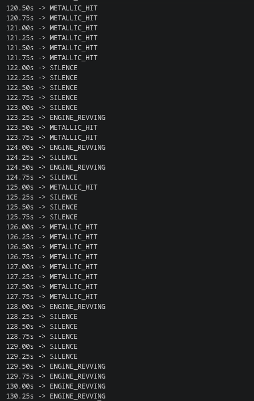

# TouchTrack
Touchtrack generates haptics for a video as an srt(like a subtile file), u can only open the srt in the modded vlc studio which is given in the releases

## Why I Built This

The idea for TouchTrack started while I was watching the F1 movie in a 4DX. Feeling haptics effects alongside the movie gave a massive immersion boost

Later, Apple released its haptic trailer for the F1 movie, which showed how haptics could be used in movies on phone. That gave me an idea, and I finally decided to build it.

The goal of TouchTrack is simple: analyze a video's events, generate haptic events automatically like u put a video and it automatically generates subtitles like that,u can play them back through a modified version of VLC because no other app supports haptics like that so i built it usign using standard `.srt` subtitle files, The haptics work just like subtitles.

## How it works 
- Detects events using CLAP
- Converts audio into haptic subtitle events
- Temporal smoothing to remove noisy detections
- Generates standard `.srt` subtitle files


```
Video
   │
   ▼
Extract audio
   │
   ▼
CLAP
   │
   ▼
Mapper
   │
   ▼
Temporal Filter
   │
   ▼
output.srt
```

---

## Features 
Supported haptic events include:
1) ENGINE_REVVING
2) WHOOSH
3) METALLIC_HIT
4) BIG_BOOM
5) THUNDER
6) WIND_GUST
7) FOOTSTEP_HEAVY
8) SMALL_CLICK
9) PISTOL_SHOT

## Haptic Library

The modified VLC player contains **82 built-in haptic patterns**, These patterns were made by ai these patterns range from impacts and explosions to vehicles, weather, footsteps, and UI feedback etc.

but the program currently generates **9 core haptic events**, with support for more events mapping planned in future releases.
---

## Screenshots

### Generated haptic



## Requirements 

- Python 3.11+
- FFmpeg
- PyTorch
- Transformers
- librosa
---

## Installation

```bash
git clone https://github.com/<your-username>/TouchTrack.git

cd TouchTrack

python -m venv .venv

source .venv/bin/activate

```
---


## How to use 

Place a video named

```
video.mp4
```

inside the project directory.

Run

```bash
python main.py
```

The generated srt will be saved as 

```
output.srt
```
Now play ur video in the modded vlc and add subtitle track as the srt 
---

## Current Limitations

TouchTrack currently uses CLAP for zero-shot audio classification.

while clap is good it sucks on this kind of stuff 

in future i wwanna replace CLAP with dedicated audio event detection models which will give better detection

---
## VLC Android

Touchtrack is designed to work with a modified version of VLC Android that supports haptic subtitle playback.

The original haptic implementation was inspired by:
https://github.com/sandyagur8/vlc-android

That fork targets an older version of VLC Android and no longer builds correctly, so the haptic implementation was ported to a newer VLC Android release.

Instructions for building the modified VLC player are in the vlc directory.

## Building the vlc 
U can find the readme on how to build vlc in the vlc folder
---

## AI Usage
Ai was used in making haptic functions for vlc as i wanted haptic support for vlc 
---

## License
MIT